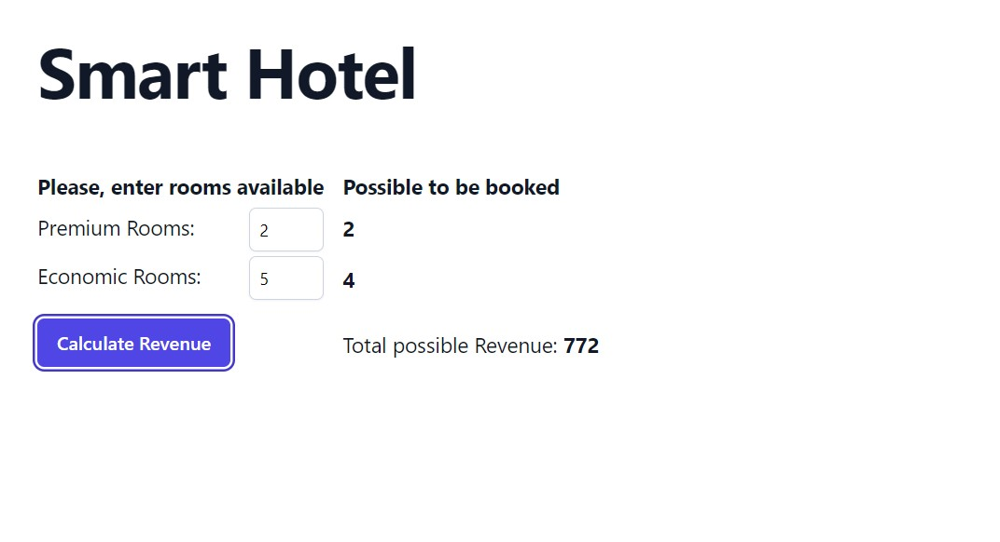

# Room occupancy optimization tool

Room occupancy optimization tool built with Vite, React 18 and TypeScript.



## What does it do?

This app provides an interface for hotels to enter the numbers of Premium and Economic rooms that are available for the night.
Then tells them immediately how many rooms of each category will be occupied and how much money they will make in total.

### Install

Clone the project.

```bash
git clone https://github.com/ViniciusLagoGehrke/smart-hotel
```

Access the project directory.

```bash
cd smart-hotel
```

Install dependencies.

```bash
pnpm install
```

Serve with hot reload at <http://localhost:5173>.

```bash
pnpm run dev
```

### Lint

```bash
pnpm run lint
```

### Typecheck

```bash
pnpm run typecheck
```

### Build

```bash
pnpm run build
```

### Test

```bash
pnpm run test
```

View and interact with your tests via UI.

```bash
pnpm run test:ui
```

## Live Site

The Web version is already deployed and you can visite live here:

[Smart Hotel](https://smart-hotel-sand.vercel.app/)

[OnPortfolio](https://front-end-portfolio.vercel.app/)